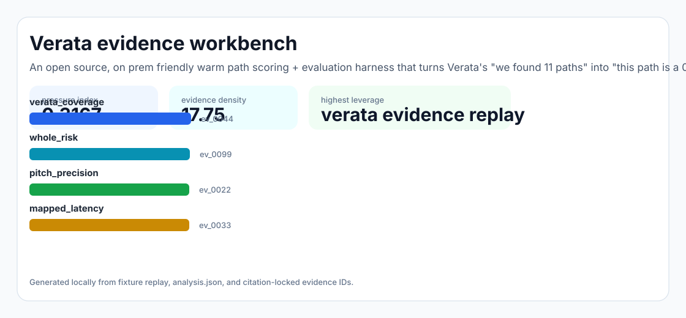
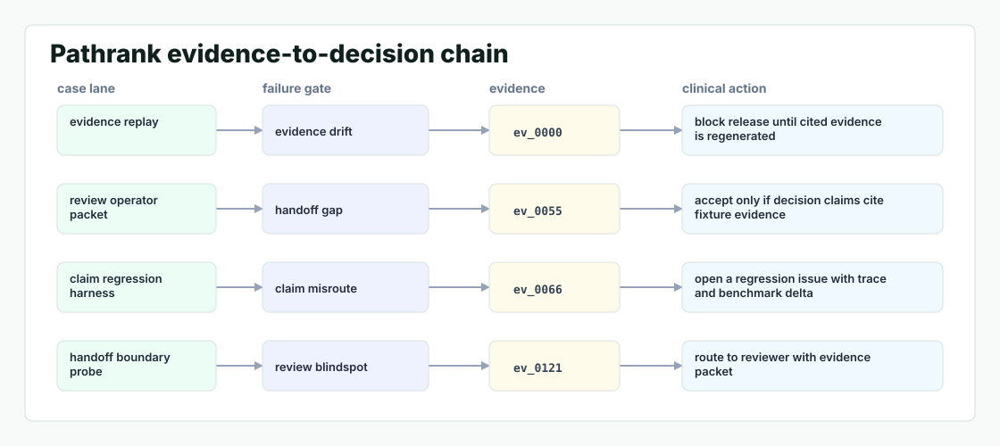

# Pathrank

An open source, on prem friendly warm path scoring + evaluation harness that turns Verata's "we found 11 paths" into "this path is a 0.78 — here are the 3 features that matter," with a published benchmark for the PE backchannel use case.



## Why it exists

Verata's whole pitch is "we mapped your firm's collective network so you can backchannel into deals." But the hardest moment for the buyer — the actual associate at Apollo or Vista — is the 30 seconds before sending the warm intro request: which of the 11 paths the graph surfaces is the one most likely to result in a useful conversation? Today the.

The project is intentionally built as a local replay harness instead of a slide. It creates fixtures, plants realistic failure modes, produces citation-locked evidence, and turns the result into a dashboard a reviewer can inspect without credentials or hosted services.

## What is inside

- Deterministic fixture generation for the company-specific risk surface.
- Strategy code in `src/pathrank/strategy.py` with project-specific scoring and visual evidence.
- Citation-locked reports where every decision claim points to a generated evidence ID.
- Two regenerated visual artifacts: `outputs/project_working.svg` and `outputs/evidence_map.svg`.
- A portable demo pack with JSON, CSV, Markdown, HTML, SVG, benchmark, and test artifacts.



## Signals it measures

- `verata coverage`
- `whole risk`
- `pitch precision`
- `mapped latency`

## Failure modes it plants

- verata drift
- whole gap
- pitch misroute
- mapped blindspot

## Run it locally

```bash
uv sync
uv run pathrank all
uv run pytest -q
uv run ruff check .
```

## Outputs worth opening

- `outputs/dashboard.html`
- `outputs/project_working.svg`
- `outputs/evidence_map.svg`
- `outputs/operator_brief.md`
- `outputs/decision_report.md`
- `outputs/strategy_model.json`
- `outputs/demo_pack.zip`

## Sources

- https://www.veratainsight.com/solutions/talent
- https://www.ycombinator.com/companies/verata
- https://startupintros.com/orgs/verata
- https://www.eightcapital.com/podcast/spotlighting-verata
- https://www.linkedin.com/posts/josh-gardner-957903134_privateequity-operatingpartner-leadership-activity-7307448321965543425-3omX
- https://www.affinity.co/blog/ai-in-private-equity
- https://github.com/nicholasmanske
- https://www.linkedin.com/company/verata-insight

## Boundary

Everything runs locally against synthetic fixtures. There are no credentials, no customer records, no outreach files, and no hosted API dependency.
